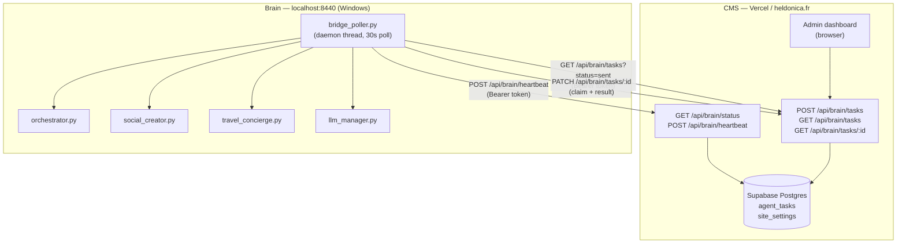
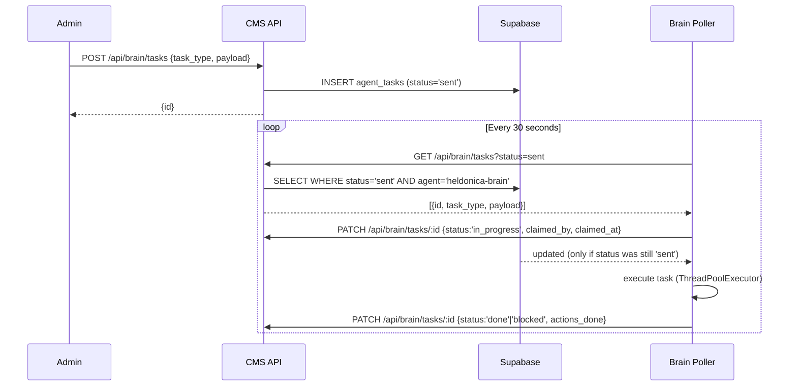
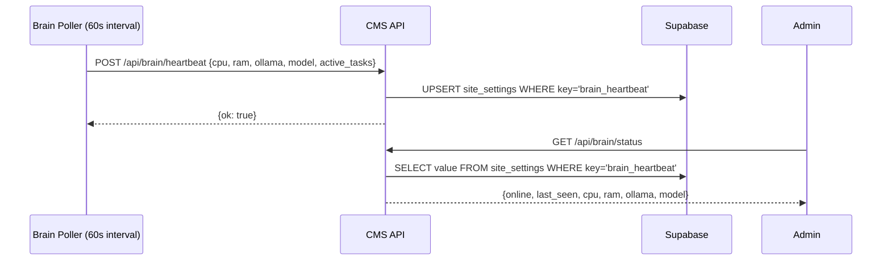

# Design Document: Brain-CMS Bridge

## Overview

The Brain-CMS Bridge creates a bidirectional communication channel between the Heldonica Brain (a local Python/FastAPI server running at `localhost:8440` on the operator's Windows machine) and the Heldonica CMS (a Next.js/Vercel application at heldonica.fr, backed by Supabase).

The core constraint is network topology: the Brain runs behind a NAT/firewall and has no stable public IP, so the CMS cannot initiate connections to it directly. The bridge inverts the direction — the Brain polls outbound, the CMS queues work and reads results. All traffic is HTTPS, all requests are authenticated with a shared secret (`BRAIN_BRIDGE_TOKEN`), and the Supabase `agent_tasks` table is the durable source of truth.

### Goals

- CMS administrators can dispatch tasks to the Brain from the admin interface without SSH or direct network access.
- The Brain autonomously picks up, executes, and reports tasks without manual triggers.
- The CMS dashboard shows Brain health (online/offline, CPU, RAM, active model) based on periodic heartbeats.
- The entire system degrades gracefully: Brain offline means tasks queue up, not errors; CMS unreachable means the Brain retries on the next poll cycle.

### Non-goals

- Real-time (sub-second) communication. The 30-second polling interval is sufficient.
- Bidirectional streaming or WebSocket upgrades.
- Brain-initiated task creation (Brain only consumes tasks; CMS creates them).

---

## Architecture

### High-level topology



### Task lifecycle



### Heartbeat lifecycle



---

## Components and Interfaces

### CMS side — new API routes

All routes are created under `app/api/brain/` following the existing Next.js App Router pattern (`export const dynamic = 'force-dynamic'`, `NextRequest`/`NextResponse`).

#### Authentication helper: `lib/bridge-auth.ts`

A new helper alongside `lib/cms-auth.ts`. CMS Bridge endpoints accept either:
1. A valid `x-cms-auth` header (existing CMS password) — for admin dashboard calls made from the browser.
2. `Authorization: Bearer <BRAIN_BRIDGE_TOKEN>` — for Brain Poller calls.

```typescript
// lib/bridge-auth.ts
export async function requireBridgeAuth(req: Request): Promise<NextResponse | null>
```

The `BRAIN_BRIDGE_TOKEN` is compared using constant-time comparison (reusing the existing `timingSafeEqual` pattern from `lib/cms-auth.ts`). If `BRAIN_BRIDGE_TOKEN` is absent from env, the endpoint returns HTTP 503.

#### `app/api/brain/tasks/route.ts` — GET + POST

- **POST**: Dispatches a new task. Validates `task_type` against the allowed set. Inserts into `agent_tasks`. Returns `{id}`.
- **GET**: Lists tasks for `agent = 'heldonica-brain'`. Supports `status` and pagination (`page`, `limit`) query params.

#### `app/api/brain/tasks/[id]/route.ts` — GET + PATCH

- **GET**: Returns a single task row including `actions_done`. Returns 404 if not found or `agent != 'heldonica-brain'`.
- **PATCH**: Used by the Brain Poller to claim a task (set `in_progress`) or to close it (`done`/`blocked`). The claim update uses a conditional `WHERE status = 'sent'` to prevent double-claiming.

#### `app/api/brain/heartbeat/route.ts` — POST

- Accepts Brain Poller heartbeat. Upserts a single `site_settings` row with `key = 'brain_heartbeat'`, storing the payload as JSON in the `value` column.
- Only accepts `Bearer <BRAIN_BRIDGE_TOKEN>` (no session cookie — the Brain has no browser session).

#### `app/api/brain/status/route.ts` — GET

- Reads `site_settings` row `key = 'brain_heartbeat'`.
- Computes `online: boolean` based on whether `last_seen` is within 120 seconds of now.
- Requires `requireBridgeAuth` (admin browser or Brain token).

### Brain side — new engine module

#### `app/engine/bridge_poller.py`

A new self-contained module, instantiated as a singleton `bridge_poller` and started alongside the orchestrator in `main.py`'s lifespan handler.

Key responsibilities:
1. **Polling loop** (30-second interval, daemon thread): fetch pending tasks, claim and execute them.
2. **Heartbeat loop** (60-second interval, same thread): send hardware metrics to `/api/brain/heartbeat`.
3. **Concurrency cap**: at most 5 tasks run concurrently via a `ThreadPoolExecutor(max_workers=5)`.
4. **Timeout enforcement**: each task submission to the executor uses `future.result(timeout=300)`.
5. **Auth**: all outbound requests carry `Authorization: Bearer <BRAIN_BRIDGE_TOKEN>`.

```python
class BridgePoller:
    def __init__(self): ...
    def start(self): ...   # called from main.py lifespan
    def stop(self): ...    # called from main.py lifespan shutdown
    def _run_loop(self): ...           # main daemon thread
    def _poll_and_execute(self): ...   # fetch + claim + dispatch
    def _execute_task(self, task: dict) -> dict: ...  # dispatch by task_type
    def _send_heartbeat(self): ...
    def _patch_task(self, task_id, payload): ...  # PATCH helper
    def _bridge_headers(self) -> dict: ...        # {"Authorization": "Bearer ..."}

bridge_poller = BridgePoller()
```

Task dispatch table inside `_execute_task`:

| `task_type` | Brain call |
|---|---|
| `generate_carousel` | `social_creator.generate_carousel(**payload)` |
| `generate_itinerary` | `travel_concierge.generate_itinerary(**payload)` |
| `run_task` | `orchestrator.execute_task(payload['task_id'])` |
| `chat` | `llm.generate(payload['message'])` |
| `status` | `get_system_status()` (inline hardware collection) |

#### Changes to `app/main.py`

Two additions to the lifespan handler:

```python
from .engine.bridge_poller import bridge_poller

@asynccontextmanager
async def lifespan(app: FastAPI):
    init_db()
    orchestrator.start()
    bridge_poller.start()   # new
    yield
    bridge_poller.stop()    # new
    orchestrator.stop()
```

#### Environment variables (Brain `.env`)

| Variable | Purpose |
|---|---|
| `BRAIN_BRIDGE_TOKEN` | Shared secret. Sent as `Authorization: Bearer` to CMS. Required. |
| `HELDONICA_SITE_URL` | Already exists. Used as base URL for all Bridge requests. |

#### Environment variables (CMS Vercel)

| Variable | Purpose |
|---|---|
| `BRAIN_BRIDGE_TOKEN` | Same shared secret. Used for constant-time verification. Required. |

---

## Data Models

### `agent_tasks` — Supabase table (additions via migration)

The table already exists with columns from three prior migrations. The bridge requires two new columns:

| Column | Type | Notes |
|---|---|---|
| `task_type` | `TEXT` | New. The bridge identifier (`generate_carousel`, etc.). Existing `task` column holds a human-readable description. Both coexist. |
| `payload` | `JSONB` | New. The structured input passed to the Brain. Max practical size ~64 KB. |

All other required columns (`id`, `agent`, `status`, `created_at`, `claimed_by`, `claimed_at`, `actions_done`, `notes`) already exist from prior migrations.

The `status` constraint from `20260911120000_agent_tasks_coordination.sql` already includes `'sent'`, `'in_progress'`, `'waiting_validation'`, `'blocked'`, `'done'` — no change needed. However, `20260903191642_agent_tasks_governance_upgrade.sql` added `'pending'`, `'failed'`, `'rolled_back'` which were removed by the later migration's `DROP CONSTRAINT / ADD CONSTRAINT`. The current live constraint is the one from `20260911`.

A partial index on `(status, agent)` already exists (`idx_agent_tasks_agent_status` from `20260911` migration). No new index needed for polling queries.

**Migration file**: `supabase/migrations/20260922000000_brain_bridge_agent_tasks.sql`

```sql
-- Brain-CMS Bridge: add task_type and payload columns to agent_tasks
-- Non-destructive; preserves all existing data and constraints.

ALTER TABLE public.agent_tasks
  ADD COLUMN IF NOT EXISTS task_type TEXT,
  ADD COLUMN IF NOT EXISTS payload   JSONB;

-- Partial index for efficient Brain polling query
-- (SELECT WHERE status='sent' AND agent='heldonica-brain')
CREATE INDEX IF NOT EXISTS idx_agent_tasks_bridge_poll
  ON public.agent_tasks (agent, status)
  WHERE status = 'sent';
```

### `site_settings` — heartbeat storage

The Brain heartbeat is stored as a single row with `key = 'brain_heartbeat'` and a JSON-serialized `value`. No schema change is needed — the table already exists with a `key TEXT UNIQUE` structure.

**Heartbeat payload shape** (stored as `value::text` in `site_settings`):

```json
{
  "last_seen": "2026-09-22T14:30:00Z",
  "cpu_percent": 12.4,
  "ram_percent": 58.1,
  "ollama_running": true,
  "active_model": "llama3.2:3b",
  "active_tasks": 1
}
```

### Task dispatch request body (CMS POST)

```typescript
interface BrainTaskRequest {
  task_type: 'generate_carousel' | 'generate_itinerary' | 'run_task' | 'chat' | 'status';
  payload?: Record<string, unknown>;  // max 64 KB
  description?: string;               // human-readable label stored in agent_tasks.task
}
```

### Task response shape (CMS GET)

```typescript
interface BrainTask {
  id: string;
  agent: string;
  task_type: string | null;
  task: string | null;          // human description
  payload: Record<string, unknown> | null;
  status: 'sent' | 'in_progress' | 'waiting_validation' | 'blocked' | 'done';
  created_at: string;
  claimed_by: string | null;
  claimed_at: string | null;
  actions_done: Record<string, unknown> | null;
  notes: string | null;
}
```

### `actions_done` shape (written by Brain on completion)

Follows the existing governance format from `AGENTS.md`:

```json
{
  "result": { /* raw output from the invoked engine function */ },
  "corrige": [],
  "verifie": [],
  "non_verifie": [],
  "reste_a_faire": []
}
```

For `status` tasks, `result` contains hardware metrics. For `generate_carousel`, it contains the full carousel dict. For `chat`, `result.reply` contains the LLM response.

---

## Correctness Properties

*A property is a characteristic or behavior that should hold true across all valid executions of a system — essentially, a formal statement about what the system should do. Properties serve as the bridge between human-readable specifications and machine-verifiable correctness guarantees.*

### Property 1: Task dispatch stores payload without modification

*For any* valid `task_type` and arbitrary JSON payload (up to 64 KB), dispatching a task via `POST /api/brain/tasks` and then retrieving it via `GET /api/brain/tasks/:id` SHALL return a `payload` field structurally equal to the one submitted.

**Validates: Requirements 1.5**

### Property 2: Claim atomicity — at most one claimer

*For any* task in `status = 'sent'`, when multiple concurrent callers attempt to set `status = 'in_progress'` with a conditional `UPDATE WHERE status = 'sent'`, exactly one SHALL succeed and all others SHALL receive a no-op update (0 rows affected), so the task is never claimed twice.

**Validates: Requirements 2.2, 6.4**

### Property 3: Task type allowlist is exhaustive

*For any* string that is not a member of `{'generate_carousel', 'generate_itinerary', 'run_task', 'chat', 'status'}`, the dispatcher SHALL return HTTP 400 and SHALL NOT insert a row into `agent_tasks`.

**Validates: Requirements 1.4**

### Property 4: Authentication rejects all invalid tokens

*For any* string that is not the exact value of `BRAIN_BRIDGE_TOKEN`, an HTTP request to any Bridge endpoint carrying that string as `Authorization: Bearer <string>` SHALL receive HTTP 401, and the endpoint SHALL NOT perform any database read or write.

**Validates: Requirements 3.1, 3.5, 3.6**

### Property 5: Online/offline determination is a function of recency

*For any* heartbeat `last_seen` timestamp T and any current time N: the status endpoint SHALL return `online = true` if and only if `N - T < 120 seconds`. This must hold for all values of T and N, including boundary values (exactly 120 seconds apart).

**Validates: Requirements 4.4, 4.5**

### Property 6: Poller never re-processes non-`sent` tasks

*For any* task whose `status` is `'in_progress'`, `'done'`, or `'blocked'` at the moment the Poller fetches it (or at the moment of the conditional update), the Poller SHALL NOT invoke the Brain execution logic for that task, and the task's `status` SHALL remain unchanged.

**Validates: Requirements 2.10**

---

## Error Handling

### CMS side

| Condition | Behavior |
|---|---|
| `BRAIN_BRIDGE_TOKEN` absent from env | All Bridge endpoints return HTTP 503 with `{ error: 'BRAIN_BRIDGE_TOKEN not configured' }`. Logged at startup if detected. |
| Invalid or missing token | HTTP 401 `{ error: 'Unauthorized' }`. No DB access. |
| Unknown `task_type` | HTTP 400 `{ error: 'Invalid task_type', valid: [...] }`. No DB insert. |
| Supabase unavailable | HTTP 503 `{ error: 'DB unavailable' }` (mirrors existing pattern). |
| Task not found or wrong agent | HTTP 404. |
| Payload exceeds 64 KB | HTTP 413 `{ error: 'Payload too large' }`. Checked before insert. |
| Concurrent claim conflict | The PATCH endpoint returns `{ success: false, conflict: true }` with HTTP 409 when `UPDATE ... WHERE status = 'sent'` affects 0 rows. The Poller interprets this as "already claimed" and skips silently. |

### Brain side

| Condition | Behavior |
|---|---|
| `BRAIN_BRIDGE_TOKEN` absent from env | `bridge_poller.start()` raises `RuntimeError` with a `CRITICAL` log event. Poller does not start. |
| CMS unreachable (network timeout, 5xx) | Log `WARNING` via `log_event`. Skip cycle. Retry next interval. No task marked failed. |
| HTTP 401/403 from CMS | Log `CRITICAL` via `log_event`. Suspend polling for 300 seconds. |
| Malformed task payload (missing keys) | Catch `KeyError`/`TypeError` in `_execute_task`. PATCH task to `'blocked'` with descriptive message. Continue loop. |
| Task execution timeout (>300s) | `future.result(timeout=300)` raises `concurrent.futures.TimeoutError`. PATCH task to `'blocked'` with `"execution_timeout"`. Continue loop. |
| Executor full (5 tasks in progress) | `_poll_and_execute` checks the count of futures not yet done. If 5 are running, skip claiming new tasks for this cycle. |
| Unexpected exception in task | Catch broad `Exception`. PATCH to `'blocked'`, log `ERROR`, continue. Never crash the daemon thread. |
| Heartbeat POST failure | Log `WARNING`. Non-fatal. Next heartbeat attempt in 60 seconds. |

### Daemon thread resilience

The `_run_loop` in `bridge_poller.py` wraps its entire body in `try/except Exception` to ensure the thread never silently dies. Any unhandled exception is logged at `ERROR` level and the loop continues after a 30-second sleep.

---

## Testing Strategy

This feature spans two codebases (TypeScript/Next.js and Python/FastAPI) and a live database. The dual testing approach is:

- **Unit tests**: verify specific logic branches, authentication decisions, task dispatch validation, and the claim-conflict path.
- **Property-based tests**: verify the universal invariants described in the Correctness Properties section.

### Property-based testing library

- **CMS (TypeScript)**: [fast-check](https://github.com/dubzzz/fast-check) — mature, well-maintained, supports arbitrary generators.
- **Brain (Python)**: [hypothesis](https://hypothesis.readthedocs.io/) — standard for Python PBT; integrates with pytest.

Each property test runs a minimum of 100 iterations.

### Property test mapping

| Property | Side | Test file | fast-check / hypothesis tag |
|---|---|---|---|
| P1: Payload round-trip | CMS | `__tests__/api/brain/tasks.property.test.ts` | `Feature: brain-cms-bridge, Property 1: payload round-trip` |
| P2: Claim atomicity | CMS | `__tests__/api/brain/tasks.property.test.ts` | `Feature: brain-cms-bridge, Property 2: claim atomicity` |
| P3: Task type allowlist | CMS | `__tests__/api/brain/tasks.property.test.ts` | `Feature: brain-cms-bridge, Property 3: task type allowlist` |
| P4: Auth rejects invalid tokens | CMS | `__tests__/api/brain/bridge-auth.property.test.ts` | `Feature: brain-cms-bridge, Property 4: auth rejects invalid tokens` |
| P5: Online/offline recency | CMS | `__tests__/api/brain/status.property.test.ts` | `Feature: brain-cms-bridge, Property 5: online/offline determination` |
| P6: Poller skips non-sent | Brain | `tests/test_bridge_poller.py` | `Feature: brain-cms-bridge, Property 6: poller skips non-sent` |

### Unit test coverage targets

**CMS (`__tests__/api/brain/`)**:
- `requireBridgeAuth`: valid CMS password, valid Bearer token, missing token, invalid token, absent env var (503).
- `POST /api/brain/tasks`: each valid `task_type`, invalid `task_type`, missing `task_type`, oversized payload, missing auth.
- `GET /api/brain/tasks`: pagination, `status` filter, empty result.
- `PATCH /api/brain/tasks/[id]`: claim success, claim conflict (0 rows), closing to `done`, closing to `blocked`.
- `GET /api/brain/status`: `online: true` within 120s, `online: false` beyond 120s, no heartbeat yet.
- `POST /api/brain/heartbeat`: valid payload stored, only Bearer token accepted (not session cookie).

**Brain (`tests/test_bridge_poller.py`)**:
- `_execute_task`: each `task_type` routes to the correct engine call.
- `_poll_and_execute`: concurrent cap (6th task is skipped when 5 are running).
- Timeout: future exceeding 300s sets task to `'blocked'`.
- CMS 401 triggers suspension logic.
- CMS network failure logs WARNING and does not crash.
- Missing `BRAIN_BRIDGE_TOKEN` raises `RuntimeError` at `start()`.

### Integration tests

A minimal integration test suite (`__tests__/integration/brain-bridge.test.ts`) using a Supabase test project (or `supabase start` locally) verifies:
- End-to-end task dispatch → polling → result retrieval with a mock Brain.
- Heartbeat persistence and status query.
- Schema migration applies cleanly on a fresh DB.

These run in CI against `supabase start` (not production) and are gated behind a `INTEGRATION=true` env flag.

### Migration verification

The migration `20260922000000_brain_bridge_agent_tasks.sql` is verified by:
1. Running it on a local `supabase start` instance.
2. Confirming `information_schema.columns` contains `task_type` and `payload` in `agent_tasks`.
3. Confirming existing rows are unaffected (`task`, `status`, `actions_done` retain their values).
